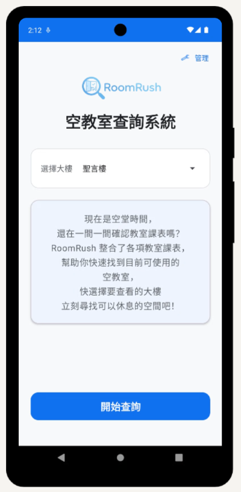
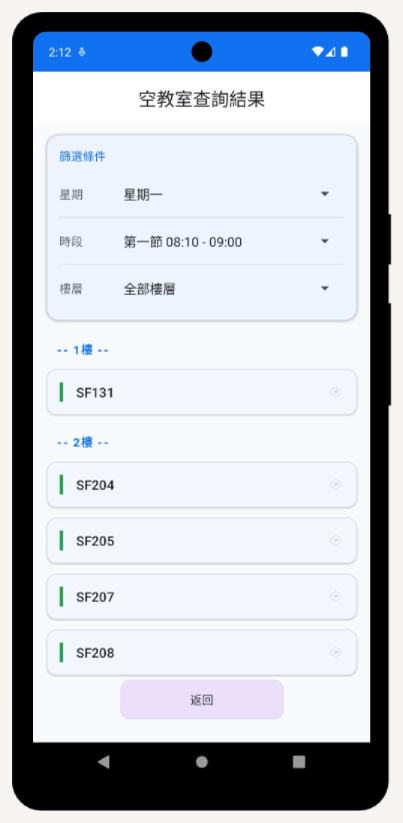
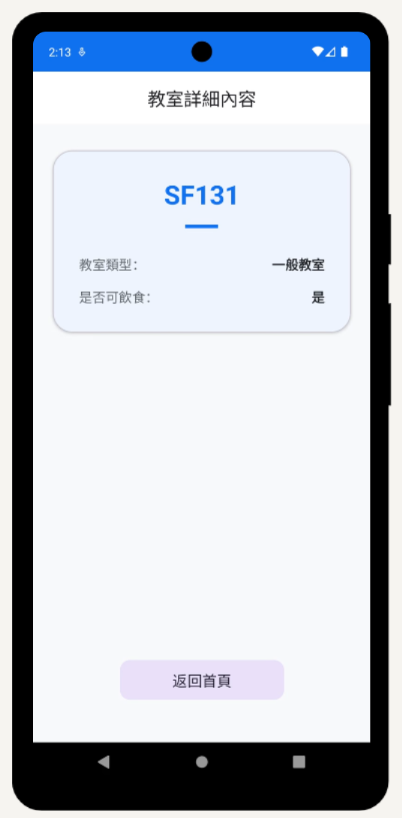

# 🔍 RoomRush
### 輔仁大學空教室查詢系統
**Fu Jen Catholic University — Available Classroom Finder**

> 114學年度下學期 ｜ Academic Year 114, Semester 2

---

<!-- 把截圖放到 repo 的 screenshots/ 資料夾後，替換下方路徑 -->

&nbsp;&nbsp;

&nbsp;&nbsp;

*首頁 ｜ 查詢結果 ｜ 教室詳細內容*

 

&nbsp;

---

## 📖 專案簡介 | About

大學生課堂間常有一到兩小時的空堂，對於住得較遠的同學來說，需要快速找到安靜的空間自習或休息。

**RoomRush** 是一款專為輔仁大學學生設計的 Android App，整合 114 學年度下學期聖言樓（SF）與進修部大樓（ES）1 至 6 樓的課表資料，讓使用者能依星期、時段、樓層即時查詢目前可用的空教室。

> This Android app helps Fu Jen Catholic University students instantly find available classrooms during free periods — filtered by day, time slot, building, and floor.

---

## ✨ 功能介紹 | Features

### 👤 使用者模式 | User Mode

| 頁面 | 功能 |
|------|------|
| 🏠 首頁 | 選擇查詢大樓（聖言樓 / 進修部大樓） |
| 🔍 查詢結果頁 | 依星期、時段、樓層篩選，即時顯示空教室（按樓層分組） |
| 📋 教室詳細頁 | 查看教室類型及是否可飲食 |

### 🔐 管理者模式 | Admin Mode

| 功能 | 說明 |
|------|------|
| 登入 / 登出 | 帳號密碼驗證，自動登出保護 |
| 課表管理 | 修改教室有課時段、刪除教室 |
| 教室詳細設定 | 設定教室類型（影響飲食規則） |
| 瀏覽教室狀態 | 查看所有教室資訊、有課時段，並可新增教室 |

---

## 🏫 教室類型對照 | Classroom Types

| 代碼 | 中文名稱 | 可飲食 |
|------|----------|--------|
| Normal | 一般教室 | ✅ 是 |
| Computer | 電腦教室 | ❌ 否 |
| Drawing | 製圖教室 | ❌ 否 |
| Lab | 實驗室 | ❌ 否 |
| MeetingRoom | 研討室 | ❌ 否 |

---

## 📱 線上試玩 | Live Demo

> 點擊下方連結，在瀏覽器中直接體驗，無需安裝任何 App
> Click the link to try the app in your browser — no installation needed.

🔗 **[線上試玩 / Try it Online →](YOUR_APPETIZE_LINK_HERE)**

---

## 🛠 技術架構 | Tech Stack

- **Platform**：Android
- **Language**：Kotlin
- **Architecture**：MVVM（Model-View-ViewModel）
- **Database**：Room（SQLite）
- **Data**：聖言樓 SF / 進修部大樓 ES，各 1–6 樓課表
- **Min SDK**：API 24（Android 7.0）
- **IDE**：Android Studio

---

## 🚀 安裝方式 | Installation

**Android 裝置安裝：**

1. 前往 [Releases](YOUR_APK_RELEASE_LINK_HERE) 下載最新 APK
2. 在 Android 裝置開啟「允許安裝未知來源應用程式」
3. 安裝並開啟 App

**網頁體驗（免安裝）：**

直接前往 [Appetize.io 試玩連結](YOUR_APPETIZE_LINK_HERE) 即可在瀏覽器操作。

---

> 本專案為課程學習作品，資料內容以 114 學年度下學期為準，僅供參考。
> This project is developed for academic purposes. Classroom data is based on the 114th academic year, second semester only.
